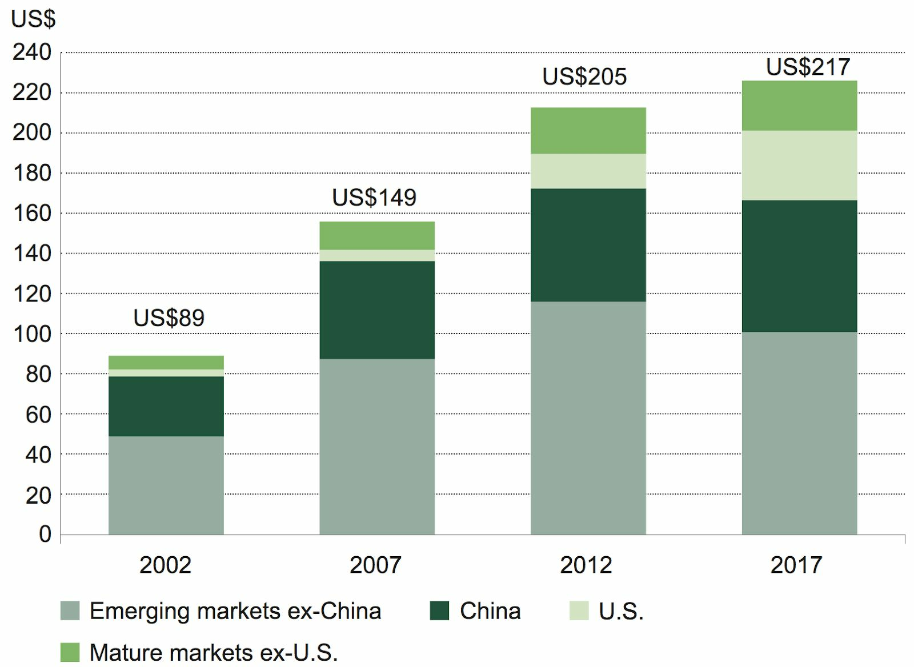

<h3>
<ol>
    <li><b><a href="#abstract">Abstract</b></a> </li>
    <li><b><a href="#content">Content</b></a> </li>
    <ol>
        <li>Issues About Other Cryptocurrencies </li>
        <li>From Gold and Silver Standard to Fiat </li>
    </ol>
    <li><b><a href="#what">What makes gold and silver a unique investment tool</b></a></li>
    <li><b><a href="#solution">The Solution to Solve Problems of Fiat Currency and Crypto-Assets</b></a></li>
    <ol>
        <li>What is Coineru</li>
        <li>What problems does Coineru solve</li>
        <li>Why do you need CGLD and CSLV?</li>
        <li>Who offers CGLD and CSLV?</li>
        <li>How many CGLD and CSLV coins are needed in the world?</li>
    </ol>
    <li><b><a href="#overview">An Overview of Coineru Ecosystem</a></b></li>
    <ol>
        <li>The enterprises that will be included in the Coineru ecosystem</li>
    </ol>
    <li><b><a href="#mission">Our Mission</a></b></li>
    <li><b><a href="#vision">Our Vision</a></b></li>
</ol>
</h3>

<h1 id="abstract">Abstract</h1>

As peer to peer transaction on different blockchains are quickly becoming one of the most popular
payment solutions of the future, no current digital token is eligible of becoming the default payment
vehicle in the crypto world until now. Thousands of tokens defectively lack real valuation, stability
and versatility, hurting the payment and circulation of ecosystems of most blockchains. Coineru was
designed and created to address those problems. Coineru offers a unique solution by extending gold
and silver exclusive characteristics bringing back the gold and silver standard to the new global
economic era.

Coineru solves these issues by creating a business ecosystem with backing each coin with one
hundred of an ounce of gold, or silver addressing the volatility and valuation issues making it possible
that this completely new blockchain technology can now solve many outstanding problems making
Coineru the first multichain financial network in the world. We have created our own multichain
with two cryptocurrencies Coineru Gold (CGLD ) and Coineru Silver (CSLV). All Coineru coins
will be available for purchase through TitanPro.ch a Swiss crypto fiat exchange and TitanPay.ch
wallet that enables customers to buy and sell CGLD and CSLV cryptos backed by gold and silver
physically stored in Switzerland. After the coins launch, anyone will be able to buy and sell Coineru
freely. Coineru are durable and can be kept safely in your cryptographically secure wallet on
TitanPro Exchange, on TitanPay wallet or any other wallet available that supports BTC or ETH.
Coineru has a unique intrinsic value and coin valuation because it’s backed by physical gold and
silver. The Coineru ecosystem will offer merchant applications (apps) and instantiations payment
processing services, making Coineru the most convenient valuable and desirable medium of
exchange across the world.

<h1 id="content">Content</h1>
<h2>Issues About Other Cryptocurrencies</h2>

In January 2009 a pseudonymous cryptographer known as Satoshi Nakamoto introduced Bitcoin as
a digital analog to gold: limited in supply, but secured by modern cryptography, and made for the
internet age. Following in Satoshi’s footsteps, many tried to improve his original vision and
thousands of alternative cryptocurrencies were born.

Bitcoin and alternative cryptocurrencies are starting to see widespread adoption. The innovation
behind cryptocurrencies is that, instead of relying on a trusted third party, transactions are recorded
and propagated in a distributed ledger known as a “blockchain.” This allows transactions to be
trustless, censorship-resistant, permission-less and private. Once a transaction is confirmed by the
blockchain network it becomes irreversible. It can’t be charged back through a dispute process like
other forms of money transfer.

Cryptocurrencies promise to radically change how we do banking by removing artificial barriers
caused by legacy financial institutions and allowing for:

<ul> 
    ❖ True peer-to-peer payments anywhere in the world 
    ❖ Minimal transaction fees and processing time compared to traditional banking 
    ❖ Payments between pseudonymous parties ensuring financial privacy 
    ❖ Non-reversible transactions preventing charge-backs and fraud 
</ul>

Unfortunately, Bitcoin and many other cryptocurrencies, showing volatility, sometimes reaching
30% loses or more for even one day - currently do not provide favorable opportunities to effectively
use them as money, for example, as a medium of circulation. At the moment, they are rather an
object of speculative investment, which showed retrospectively high profitability and losses,
which can not guarantee high profitability in the future. Bitcoin and many other cryptocurrencies
do not have any backing. Their price is mainly determined by the ratio of supply and demand. The
absence of any backing is used by official governments to condemn cryptocurrencies and point out
the signs of "soap bubbles" in them..

Coineru Gold, with a ticker symbol CGLD is backed by one hundred of an ounce of physical gold
and Coineru Silver with a ticker symbol CSLV is fully backed by one hundred of an ounce of
physical silver. Both coins are also a safe haven solution for many financial global issues bringing back
the gold and silver standard.

<h2>From Gold and Silver Standard to Fiat</h2>

Gold and silver have always had emotional, cultural and financial value. But their key advantage is
that gold and silver are investment metals. Gold and silver have been globally accepted in more than
194 countries for centuries, thus establishing themselves as the ultimate form of currency.

<h1 id="what">What makes gold and silver a unique investment tool</h1>

<u>High preservation capacity.</u>​ ​ Gold and silver are one of the most long-life materials on Earth. 

<u>Liquidity.</u> ​Gold and silver have held an universally recognized value in all corners of the world for
thousands of years.  

<u>Divisibility, integrability and qualitative homogeneity.</u> ​ Gold and silver are plastic precious metals and
can be cast as bars of a certain weight and fineness which will be standardized and homogeneous.  

<u>Rarity​.</u> T​ here is little gold and silver on Earth and its total volume is limited.  

According to the World Gold Council, the annual volume of gold bought by investors has increased
by no less than 235% over the past three decades. 

Even after 1971 when the U.S. abandoned its “Gold Standard,” gold remains a valuable asset that
serves as a precious metal and real money until today.

As today, trust in fiat money is based on what is referred to as the “full faith and credit” of the
government that issues the fiat money in question. There is no asset backing the currency; the dollar
value is based on what citizens think it is worth rather than an intrinsic value. If the government
increases the supply of fiat money at will, the value will drop with no destination as it is subject to
abuse and miscalculation. That is why money supply today is a major topic for many governments
who have employed quantitative easing policies in the past few years. Any misbehavior by the
government or politicians could result in significant stress of the value of that currency.

</img>

According to the ​Institute of International Finance
(IIF), in 2017 the global debt reached a huge
amount of 217 trillion dollars, this is 327 percent
of the world’s gross domestic product (GDP).

Before the era of financial crisis, the global debt was
149 trillion dollars and it has increased by 70
trillion in just ten years.

This debt poses a huge risk by creating a global
financial “bubble” the collapse of which will result
in a crisis of truly biblical results.

The key effect is to take away the ease at which politicians can create money to manipulate money
supply due to its scarcity of resources. The commodity-backed currency indeed rectifies the shortfall
of the fiat money by benchmarking its value against commodity.

One of the main Coineru currency advantages is protection from inflation and possible political and
other country risks due CGLD being backed by 100th of an ounce of gold and CSLV being backed
by 100th of an ounce of silver including the possibility of exchanging CGLD and CSLV for real gold
and silver.

<h1 id="solution">The Solution to Solve Problems of Fiat Currency and
Crypto-Assets</h1>
<h2>What is Coineru</h2>

Coineru and its two coins CGLD and CSLV also known as the currency of life is a multichain
financial network acting as a safe haven and a counterpoint to the unstable global payment system.
The current payment system, which is controlled by conventional banks, is inefficient,
inhomogeneous, fragmented, expensive and time consuming. Furthermore, the tender currencies
used as payment means are mainly based on the trust that governments of the respective countries are
stable and provide an economy that satisfies the value of the tender currencies issued. However, they
can simply increase the number of their respective currencies, if there is a need for it. This leads to
inflation and people losing their money.

<ul>
❖ Circulating Coineru Gold has valuation representing one hundred of an ounce of physical
gold bullion stored in swiss vaults of Coineru Reserve Inc. Each CGLD can be exchanged for
physical gold in Switzerland when a coin is being put out of circulation by returning the coin
to the issuer in this case Coineru Reserve Inc. CGLD is governed by the proof of physical gold
ownership. (‘’PPGO’’) 

❖ CGLD will always have 100% of its value backed by real, physical, gold bullion. 

❖ With real physical gold value backing CGLD will serve as the gold standard and a safe option
to replace the current global financial system.  

❖ The gold bullion kept under vault will be audited from time to time to confirm the actual
amount held in reserve.  

❖ Circulating Coineru Silver has valuation representing one hundred of an ounce of physical
silver bullion stored in swiss vaults of Coineru Reserve Inc. Each CSLV can be exchanged for
physical silver in Switzerland when a coin is being put out of circulation by returning the coin
6to the issuer in this case Coineru Reserve Inc. CSLV is governed by the proof of physical silver
ownership. (‘’PPSO’’)  

❖ CSLV will always have 100% of its value backed by real, physical, silver bullion.  

❖ With real physical silver value backing CSLV will serve as the silver standard and a safe option
to replace the current global financial system.  

❖ The silver bullion kept under vault will be audited from time to time to confirm the actual
amount held in reserve. 

</ul>
<h2>What problems does Coineru solve:</h2>
I. At the moment there is no strong connection between the circulation of cryptocurrencies and the
conventional financial infrastructure. 

Coineru created a bridge between the conventional finance and the blockchain-based economy, thus
becoming a new center of the global cryptocurrency system. 

II. Undeveloped cryptocurrency infrastructure. 

Today, there is no comprehensible infrastructure available to provide quick and reliable access to
cryptocurrency assets. This impedes the interaction between the conventional economy and
crypto-economy, practically isolating them from each other and giving rise to additional problems. 

Coineru is focused on involving broad masses of users by creating a familiar financial infrastructure
on a cryptocurrency basis. The current key task of Coineru is to establish services that will excel the
traditional payment infrastructure in terms of convenience and reliability and provide easy access to
the use of cryptocurrencies that have physical gold and silver behind.

<h2> Why do you need CGLD and CSLV?</h2>
I. Defense of inflation 

CGLD and CSLV employ the gold and silver standard, meaning that each CGLD and CSLV is put
in circulation and correct corresponding amount of gold and silver bullion is held in coineru reserve.
The scarcity of physical gold will effectively limit devaluation as compared to the devaluation issues
that fiat money faces currently and unlock the untapped valuation potential of real physical gold and
silver ownership in the form of instantiations secure financial system becoming the new form of
global money. 

II. Ultimate safe haven  

Although gold and silver are no longer the basis of the international monetary system, their statuses as
a bastion of stability has endured, a role which has become increasingly important in today’s
uncertain environment. Over the years, gold and silver’s reputation for safety and stability has made it
a mainstay for investors seeking to safeguard the long-term value of their capital. 

<h2>Who offers CGLD and CSLV?</h2>

CGLD and CSLV are developed and offered by Coineru Reserve Inc.

Coineru Reserve Inc. is a Special Purpose Company (SPC). The business objective of this SPC is to
acquire and store the physical gold and silver behind Coineru, offer CGLD and CSLV on its
proprietary patent pending multi chain financial network and develop CGLD and CLSV related
solutions to serve participants of the Ecosystem.

<h2>How many CGLD and CSLV coins are needed in the world?</h2>

26 billion CGLD and 26 billion CSLV coins would be able to fulfill the global need in order to
replace all economic activity back to the gold and silver standard.

<h1 id="overview">An Overview of Coineru Ecosystem</h1>

The Coineru ecosystem aims to build a stable ecosystem in which the market of FIAT currencies,
financial products and other assets together with the new market of digital currencies is combined in
a new multichain financial network.

The Coineru ecosystem will comprise the following functions, services and applications, each
element of which will create the demand for coins or create an infrastructure to maintain them.

<h2>The enterprises that will be included in the Coineru ecosystem.</h2>

The exchange of CGLD and CSLV for FIAT currencies or other crypto will be available via the
swiss basses TitanPro crypto fiat exchange and TitanPay wallet and debit cards financial
infrastructure. In this way, the Coineru ecosystem offers its participants a holistic solution to operate
and manage over currencies and assets. It creates an integrated highly secure trading platform and
8wallet where participants are provided with the required exchange and money transfer services.

<h1 id="mission">Our Mission</h1>
The mission of Coineru is to create and develop a global infrastructure that will become a bridge
between conventional and cryptocurrency financial systems. This will make Coineru the center of
the future economy built on blockchain technologies. 

Coineru is currently creating an international payment system that will serve the blockchain-based
economy.

<h1 id="vision">Our Vision</h1>
Coineru is based on a clear vision of the future new economy and blockchain-based financial
operations that will be much faster and secure than the existing ones. 

A full-fledged functioning of the global financial ecosystem based on Coineru will be the
core of the infrastructure being created.  

Eventually, this ecosystem will become the basis for the creation of a new financial world based on
Coineru’s first universal multi chain technology where any intermediaries will be completely
excluded. 

Coineru will become the basis of an environment efficient and beneficial for introducing a new
economy.  

The key point of Coineru vision is the consistent incorporation of real money which, unlike the fiat
ones, will hold real value and will be backed in gold and silver, thus making economic relations more
productive.  

Any cryptocurrency, as well as fiat money, is underlain by the trust of those who use it. This trust is
based on the ability to efficiently use the cryptocurrency and on understanding that it is supported by
efficient structures. High volatility of the existing cryptocurrencies and the loan debt burden on fiat
money make the existing financial system extremely unstable. 

Coineru supports and develops the cryptocurrencies, which will be backed in gold and silver, and will
allow shoring up the economy. That's why Coineru Reserve Inc postures itself as a company engaged
in world trade based on using physical gold and silver as a method of payment. 

GGLD and CSLV coins are the new money with real gold and silver of real value. Each day,
cryptocurrencies are getting more and more spheres of application, they are continuously perfected
technologically; they acquire a new functionality and, unlike fiat money, are evolving. The Coineru
coins CDLD and CSLV will be this evolution.  

Coineru Reserve Inc will manage blockchain-based proof of physical gold and silver ownership
PPGO and PPSO, for the benefit of its customers.  

Due to these global changes and visionary activities, Coineru will lead the process of conventional
economy transformation and will become the pioneer and leader of the new multichain financial
network of the world.  

For more information visit ​www.coineru.com